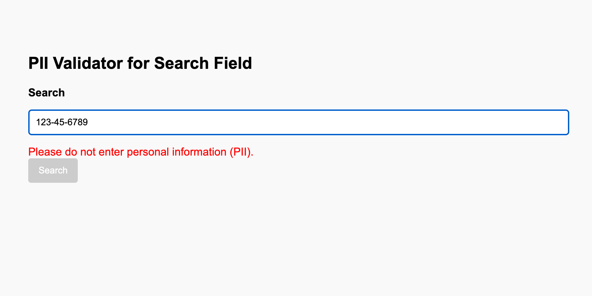

# PII Validator for Search Field


This simple HTML project demonstrates how to prevent users from entering personally identifiable information (PII) into a search field using basic JavaScript pattern matching.

🔗 [Live Demo](https://billsantry.github.io/pii-validator-search/)

---

## Features
- 🚫 Validates user input for common PII formats:
  - Social Security Numbers (SSNs)
  - Credit Card Numbers
  - Phone Numbers
  - Email Addresses
  - Dates
  - Street Addresses
- ⚠️ Displays a warning message in real time
- 🧩 Optional configurations:
  - Block form submission
  - Redact input with [REDACTED]
  - Disable the search button

---

## Screenshot


---

## Configuration
Modify the `piiValidatorConfig` object in `index.html` to control behavior:

```js
const piiValidatorConfig = {
  blockSubmission: false,  // Prevents form submission if PII is detected
  redactInput: false,      // Replaces detected PII with [REDACTED]
  disableSearch: true      // Disables the search button if PII is detected
};
```

---

## Tech Stack
- HTML5
- JavaScript (Vanilla)
- GitHub Pages for hosting

---

## File Structure
```
pii-validator-search/
├── index.html
├── favicon.png
├── screenshot.png
├── README.md
├── LICENSE
└── .gitignore
```

---

## License
This project is licensed under the MIT License. See the LICENSE file for more details.

---

## Disclaimer
This validator uses basic regex patterns and is not a comprehensive PII detection engine. Always validate sensitive data on the server side and consider more robust solutions for production environments.
